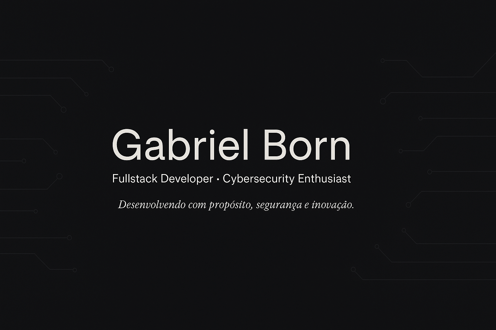

---

## 👋 Sobre Mim

Sou Gabriel Born, estudante do 3º ano do Ensino Médio na Escola S (SESI) e Técnico em Análise e Desenvolvimento de Sistemas (ADS) no SENAI, em Florianópolis, SC. Apaixonado por tecnologia desde cedo, cresci em uma família que valoriza educação e inovação. Meu objetivo é criar soluções tecnológicas que impactem positivamente, combinando desenvolvimento fullstack, cibersegurança e design. Planejando graduação em ADS, Ciberdefesa, Bancos de Dados ou Redes de Computadores, busco resolver problemas e colaborar em projetos inovadores.

- 🧠 Interessado em desenvolvimento fullstack, cibersegurança, Linux, scripting e redes
- 🎨 Crio interfaces intuitivas com Figma e Canva
- 🤝 Habilidades interpessoais: trabalho em equipe, comunicação, liderança, resolução de problemas
- 📍 Florianópolis, SC - Brasil

---

## 🛠️ Tech Stack

### 💻 Linguagens de Programação


---

### ⚛️ Frameworks e Bibliotecas


---

### 🗄️ Bancos de Dados & Backend


**Backend / APIs**  
- Node.js / Express  
- REST & GraphQL  
- Serverless Functions (Vercel / Supabase)  
- Autenticação JWT / OAuth / NextAuth  

---

### 🛠️ Ferramentas & DevOps


- Docker básico  
- CI/CD com GitHub Actions  
- Monitoramento: LogRocket / Sentry  
- Bundlers: Webpack / Vite  

---

### 🎨 Design & UI/UX


- Prototipagem avançada (Figma / Design System)  
- Animações e transições complexas  
- Design responsivo e acessível (WCAG)  
- Dark / Light mode  

---

### 🖥️ IDEs & Ambientes


---

### 🧪 Testes & Qualidade
- Unit Tests (Jest / React Testing Library)  
- E2E Tests (Cypress)  
- Testes de UI e componentes React  
- Boas práticas de código e documentação  

---

### 🌐 Outros Conhecimentos
- Integração com Google APIs (Sheets, Drive, Calendar)  
- Metodologias ágeis: Scrum / Kanban  
- Projetos Open Source / Portfólio online  
- Manutenção de sistemas robustos, modularização e documentação

---

## 🏆 GitHub Trophies

<div align="center">
  
</div>

---

## 📊 Estatísticas do GitHub

<div align="center">

  <h3>🔤 Linguagens Mais Usadas</h3>
  
  
  <h3>🔥 Contribuições em Sequência</h3>
  
  
  <h3>📈 Estatísticas Gerais</h3>
  

  <h3>📊 Estatísticas do WakaTime</h3>
  <!--START_SECTION:waka-->

```txt
From: 14 February 2026 - To: 21 February 2026

Total Time: 0 secs

No activity tracked
```

<!--END_SECTION:waka-->


[](https://wakatime.com/@GabrielB0rn)


</div>


  


## 🚀 Projetos em Destaque

| Projeto         | Descrição                                                                                       | Link                                                       |
|-----------------|-------------------------------------------------------------------------------------------------|------------------------------------------------------------|
| **EasyDesk.io** | Sistema de gestão de empresa desenvolvido como parte do curso de Análise e Desenvolvimento de Sistemas (ADS). | [🔗 Ver no GitHub](https://github.com/Gabrielb0rn/EasyDesk.io) |
| **EcoSmart.io** | Sistema de gestão de energia integrando IoT (Arduinos), aplicativo e site. Projeto em desenvolvimento. | [🔗 Em desenvolvimento](https://github.com/Gabrielb0rn/) |
| **Veritas**     | Sistema para escritório de advocacia, com front-end + back-end usando React, Next.js, ORM e PostgreSQL. Projeto mais completo do curso ADS. | [🔗 Ver site](https://veritas3.vercel.app/) |
| **Portfólio 1T 2025** | Portfólio desenvolvido no primeiro trimestre de 2025, exibindo trabalhos, atividades e projetos acadêmicos em site interativo. | [🔗 Ver site](https://v0-site-o3.vercel.app/) |

### Legenda
- **SA** = Situação de Aprendizado  
- **IoT** = Internet das Coisas (Arduinos)  
- **ADS** = Análise e Desenvolvimento de Sistemas (Curso do SENAI)  


---

## 📜 Certificações

- **Programação em Linguagem Python** – 40h  
  [📄 Certificado](https://5d1d8e34-bea7-4d4a-97f1-62b5fa0161f5.filesusr.com/ugd/c7505a_f346cbbc84d648fa911989c39de5f63e.pdf)
- **Educação Financeira** – 30h

---

## 🤝 Habilidades Interpessoais

- Trabalho em equipe
- Comunicação eficaz
- Liderança
- Resolução de problemas
- Adaptabilidade

---

## 🔗 Contato

- 📧 [gabrielborn1111@gmail.com](mailto:gabrielborn1111@gmail.com)
- 💼 [LinkedIn](https://www.linkedin.com/in/gabriel-oliveira-born-88019b292/)
- 🌐 [Portfólio](https://gabrielborn.vercel.app/)

---


## 😄 Curiosidades

- 🧭 Ex-escoteiro por 10 anos, com paixão por liderança e estratégias de sobrevivência
- 🥋 Ex-faixa-ponta-azul por 6 anos, desenvolvendo disciplina, foco e resiliência
- 🔫 Treinamentos com réplicas realistas e foco em táticas CQB
- 📚 Leitor de materiais militares e estratégias SEAL
- 🎧 Música, foco e disciplina são pilares da minha rotina

---

<div align="center">
<br><p align="centre"><b>👁️‍🗨️</b></p>  
<p align="center"></p> 
<br></div>

<p align="center">
  
</p>


<br>


<h1 align="center"> Extra </h1>

Aqui compartilho meu respeito e apreço pelas Forças Armadas do Brasil.  
Nesta seção, você encontrará frases de instrutores, canções militares, ideais de conduta e reflexões sobre liderança, honra e disciplina — virtudes que levo comigo em tudo que faço.

---

## ⚔️ Espírito de Combate

> “Alguns dizem que já se nasce Comandos — que é preciso apenas ir lá e buscar o que é seu por direito.  
> Outros dizem que ser Comandos é uma escolha: a decisão consciente de continuar, mesmo quando tudo diz para parar.  
>  
> Mas há algo em que todos concordam:  
> Quem for digno conquista esse nome para sempre.  
>  
> Cansaço físico e mental, pressão psicológica, cobrança constante por resultados —  
> Tudo isso é parte do caminho.  
>  
> Mas os Comandos não param.  
>  
> Eu me chamo Comandos.  
>  
> Em troca, me deram outro nome... e um número.”

---

## 🛡️ Frases dos Comandos / Forças Especiais

- **"Apenas o trauma coletivo gera união."**
- **"Qualquer missão, qualquer hora, qualquer lugar, de qualquer maneira."**
- **"A faca brilha e a caveira sorri."**  
  > A risada dos Comandos: mesmo diante da morte, eles sorriem. Desafiá-la é dizer que não é hoje que vão partir.
- **"A gente não quer saber no que você é bom. A gente quer saber no que você é ruim. É ali que eu vou ficar, todo dia, durante seis meses, até você ir embora."**
- **"Quando você vê um Comandos, vê alguém que vai aguentar tudo. O símbolo do punhal na caveira significa vencer a morte. Você matou a caveira."**
- **"Os Comandos não morrem — desaparecem, para reagrupar no inferno e atormentar o demônio."**
- **"Senhores, eu vou mastigar o cérebro dos senhores. Não fui buscar ninguém em casa."**
- **"A diferença entre o que eu sou e no que eu quero me tornar é o agora."**
- **"Quem tem pena é galinha. Os fracos que se arrebentem."**
- **"A sorte acompanha os audazes."**
- **"Esgotan-se os meios da rendição pacífica: que venham os Comandos!"**
- **"Numa noite escura, dentro da água, perdi o nome que meus pais me deram. Em troca, me deram outro nome... e um número. Eu me chamo: COMANDOS."**

---

## 🎵 Trechos da Canção dos Comandos

- **"Surpresa e sorte natural, acompanham a caveira e o punhal."**
- **"O rosto dos Comandos ninguém vê. Suas garras, quem sentir, não viverá."**

---

## 💬 Diálogo Inspirador dos Instrutores

> **"Sabe como os Comandos se cumprimentam?"**  
> Alguns instrutores apareciam na noite escura, com uma voz acolhedora ao aluno exausto:

- “Aluno, tá vibrando?” — **"COMANDOS!"**  
- “Aluno, tá cansado?” — **"COMANDOS!"**  
- “Aluno, quer ir embora?” — **"COMANDOS!"**

> Alguns alunos não percebiam: era um teste.  
> Ao abrir o coração, mostravam o elo fraco da corrente.  
> Responder "Comandos" não era fingir que estava tudo bem,  
> mas mostrar força de vontade, disciplina e compromisso.

> Ser vulnerável não é contar tudo a qualquer um —  
> é saber com quem você pode ser humano.  
> **Se quiser nadar entre tubarões, não sangre perto deles.**

---

## 🐺 Sobre o PARA-SAR / PARA-COMANDOS

> **"A formação básica de um PARA-SAR exige cerca de sete cursos operacionais."**  
> O PARA-COMANDOS está no topo da hierarquia operacional.

Por que o **pastor**?  
Porque o PARA-SAR adotou o pastor-alemão como símbolo.  
Espelhado nele:  
**adestrado, corajoso, leal, vigilante e, se preciso, agressivo.**

---

## ✝️ Frases Espirituais e Bíblicas

- **"Adsumus."** — (Frase do CFN – Corpo de Fuzileiros Navais: “Estamos presentes.”)
- **"Posso todas as coisas naquele que me fortalece."**
- **"(Batalhão de Infantaria Paraquedista)"**  
  _"Mas os que esperam no Senhor renovarão suas forças;  
  subirão com asas como águias,  
  correrão e não se cansarão,  
  caminharão e não se fatigarão."_ — Isaías 40:31

---

## 🗡️ Reflexão Filosófica / Operacional

> **"O Forças Especiais é como uma luva segurando uma faca.  
> A luva não é sua mão. É a luva.  
> Como se você tivesse a capacidade de empunhar o punhal e agir,  
> sem que fosse você mesmo."**
